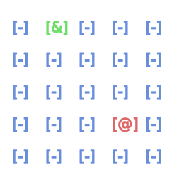

<h1 align="center">
  cli-tilemap
</h1>
<p align="center">
  <a href="https://crates.io/crates/cli-tilemap">
    -FED688?style=for-the-badge">
  </a>
</p>
<h3 align="center">
  Rust crate that provides basic functionality of Tilemap for CLI-based games!
</h3>
<br>

This module contains the `Tile` trait, allowing to represent other data types as tile,
or more specifically as `StyledContent<&'static str>`, provided by the `crossterm` crate,
and the `TileMap<T>` type, representing a tilemap of `T`, where `T`: `Tile` + `Default`,
which is based on the `GridMap<V>` from `grid-math` crate, which is a wrapper around the `HashMap<Cell, V>`.
<br><br>
```
Note:
- Crate is in the "work in progress" state, so the public API may change in the future. Feel free to contribute!
```
<h3>Examples:</h3>

```rust
use cli_tilemap::{Tile, TileMap, Formatting};
use crossterm::style::{Stylize, StyledContent};
use grid_math::Cell;
use std::io::stdout;

// declare Entity enum
#[derive(Default, Debug)]
enum Entity {
    Enemy,
    Hero,
    #[default]
    Air,
}

// represent Entity as tile
impl Tile for Entity {
    fn tile(&self) -> StyledContent<&'static str> {
        match self {
            Self::Air => "[-]".dark_grey().bold(),
            Self::Hero => "[&]".green().bold(),
            Self::Enemy => "[@]".red().bold(),
        }
    }
}

fn main() {
    // create 5x5 tilemap:
    let mut map: TileMap<Entity> = TileMap::new(5, 5);
    // modify formatting rules for map:
    map.formatting.tile_spacing = 1; // already 1 by default
    map.formatting.row_spacing = 1; // already 1 by default
    // insert entities:
    map.insert(Cell::new(3, 3), Entity::Enemy);
    map.insert(Cell::new(1, 0), Entity::Hero);
    // draw map to the raw stdout:
    map.draw(&mut stdout()).expect("should draw!");
    // or transform tilemap into string:
    //let map_str = map.to_string();
    //println!("{map_str}");
}

```
<br>

This will create new `TileMap<Entity>`, fill it with some instances of `Entity`, and then `draw` it to the `stdout`:


<br>

```
Note:
- `TileMap` type is based on the `GridMap` type, provided by the `grid-math` crate,
  so to get more detailed explanation about `Cell`, `Grid`, and `GridMap` types, visit it's documentation.
- Also, to get more information about `StyledContent` type, `Stylize` trait, visit `crossterm` documentation.
```

For more examples, visit `cli-tilemap` documentation on https://docs.rs/cli-tilemap/latest/cli_tilemap/  Crab Crab! 🦀🦀
